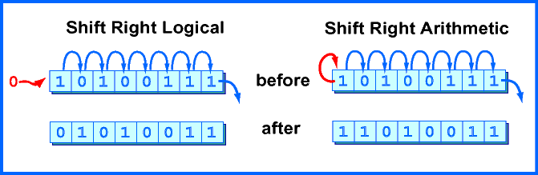

### xor rdi, rdi

rdiレジスタに rdiとrdiをxorした結果を入れる
mov rdi, 1
xor rdi, rdi
は 1, 1なので0が入る

mov rdi, 0より実行効率がいいらしい

### リターンコード

0

### exit システムコールの第一引数

rdiはsyscall実行時に値が第一引数として参照される模様
rdi, rsi, rdx, ...
0

### ascii　コードチェック

```
$ man ascii
```

### difference between sar and shr

- sar Shift arithmetic right.(算術シフト)
    - 符号ビットを除いてシフトするもので、空いたビット位置すべてに左シフトの時は０、**右シフトの時は符号ビットと同じものが入る**

- shr Shift logical right.(論理シフト)
    - 符号ビット（先頭ビット，第１５ビット，最も左のビット）を含めてシフトするもので、空いたビット位置すべてに０が入る



intel's volume 1, 5.1.5

### 数を10進`以外`の方法でnasmが理解できるように書くにはどうするか

https://www.nasm.us/doc/nasmdoc3.html#section-3.4.1
参照

### je, jz

- je
    - jump if equal

- jz 
    - jump if zero

### list of each test

Todo

```
section .data
test: dq -1

section .text
    mov byte[test], 1
    ; 01 FF FF FF FF FF FF FF 

    mov word[test], 1
    ; 01 00 FF FF FF FF FF FF 

    mov dword[test], 1
    ; 01 00 00 00 FF FF FF FF

    mov qword[test], 1
    ; 01 00 00 00 00 00 00 00
```

### Todo

- q_20
- q_21
- q_22

### rax, eax, ax, ah, al のレジスタにはどういう関係があるか

eax は raxの下位4バイト
axはraxの下位2バイト
alはraxの最下位バイト
ahはaxの上位バイト

raxだけ最下位ワードの上位バイトにアクセスできる(ah)

### r9レジスタの一部にアクセスするにはどうすればよいか

@Todo
関数コールで暗黙的に引数としてとられるので
関数側で触りにいく

### ハードウェアスタックの使い方は? 利用できる命令は?

関数などで使用され、意図しないレジスタの書き換えを防ぐために
値のキャッシュ場所として使える
利用できるのはハードウェアスタックに書き込むpush
取り出すpop

### 次にあげる命令のうち、正しくないのはどれか、理由は

- mov [rax], 0 # raxメモリの初期化 -> ○
- cmp [rdx], bl ; rbxの下位バイト -> ○
- mov bh, bl -> ○
- mov al, al -> 意味ないから☓?
- add bpl, 9 -> スタックフレームのポインタなのでいじるべきではない - ☓?
- add [9], spl -> 9のアドレスのメモリ内容が書き換わるだけなので○?
- mov r8d, r9d -> 問題ない
- mov r3b, al -> ○
- mov r9w, r2d -> 下位2バイトに下位3バイトはオーバーフロー?するので☓
- mov rcx, [rax + rbx + rdx] ○
- mov r9, [r9 + 8*rax] ○
- mov [r8+r7+10], 6 ○
- mov [r8+r7+10], r6 ○

### 呼び出し先退避レジスタ

p33

rbx, rbp, rsp, r12-15

### 呼び出し元退避レジスタ

呼び出し前に退避、呼び出し後に復旧

上記7個以外

### ripレジスタの意味

rip is Instruction Pointer Register

ripには次に実行すべき命令のアドレスが格納される
プログラマがアクセス可能

### what is SF flag

算術命令で結果がマイナス値だったときにセットされる

### what is ZF flag

算術命令をしたときに結果が0だったときにセット

### explain under each operation

- sar
    - 左ビットシフト
- shr
    - 右ビットシフト
- xor
    - 排他的論理和
- jmp
    - 定義したラベルへジャンプさせる
- ja, jb, その他
    - jump if above
    - jump if below
    - jg 
        - jump if greater
    - jl 
        - jump if less
    - jae 
        - jump if above or equal
    - jle 
        - jump if less or equal
- cmp
    - オペランド比較, compare
- mov
    - データ転送
- inc, dec
    - 加算, 減算
- add
    - 足し算
- imul, mul
    - 符号なしかけ算
    - かけ算
- sub
    - 引き算
- idiv, div
    - 符号なし割り算
    - 割り算
- call, ret
    - プロシージャ呼び出し
    - 復帰
- push, pop
    - push: push stack
    - pop: pop from stack
- neg
    - 符号の反転

### ラベルとは何か、サイズはあるのか

処理のスコープを表す
プログラム全体に定義できるグローバルラベル
.から始まるローカルラベルがある

Todo サイズについて

