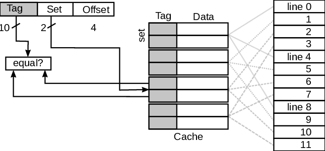

### その他ページ置換法

### man procfs

- 経過時間
- プロセス番号

プロセスがshared(s), private(p)かもメモリマップみればわかる

### associative cache

連想キャッシュ
tagによってメインメモリとキャッシュメモリを紐付ける
そのため、メインメモリは複数のキャッシュを参照できる
2-way associative cache
4-way associatibe cache
など

Todo
アドレスリクエストはTagとWordを足したもので行われる?
22bit Tag
2bit Word
↓ら辺見た限り

https://www.slideshare.net/Sajith3D2010/memory-mapping-cache

これがわかりやすいな
2-way 2つのセットのうち
どれかを指定して、さらにTagが等しければ
Hit って感じかな

OffsetはTodo